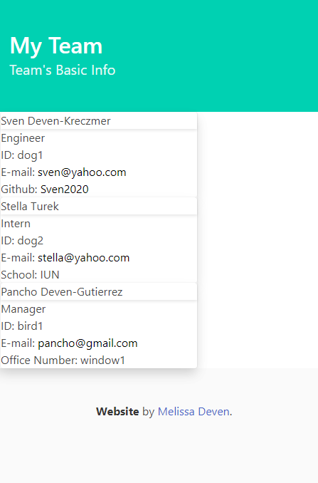
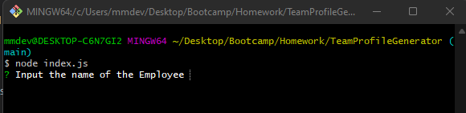
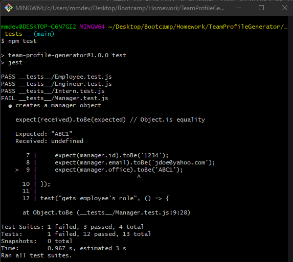
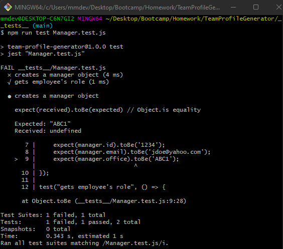

# TeamProfileGenerator

## Description

This application is a Node.js command-line application that takes in information about employees on a software engineering team, then generates an HTML webpage that displays summaries for each person. The application also units a unit test for every part of the code.

Image of generated HTML:

- What was your motivation?
- Why did you build this project? (Note: the answer is not "Because it was a homework assignment.")
- What problem does it solve?
- What did you learn?

## Table of Contents 

- [Installation](#installation)
- [Usage](#usage)
- [User Story](#User_Story)
- [Tests](#tests)

## Installation

The application us using Jest for running the unit tests and Inquirer for collecting input from the user. The application is invoked by using the following command:

    node index.js

## Usage

The user is prompted for team members and their information in acceptable text format. Then a HTML file is generated that displayed a nicely formatted team roster based on user input. 

When the user clicks on an e-mail address in the HTML, a default program opens and populates the "to" field of the e-mail with the address. Additionally, when the user clicks on the GitHub username, a GitHub profile opens in a new tab. 

The user is asked a series of questions including name, ID, e-mail, office number if a manager, school if an intern, and GitHub username if an engineer. There are validation controls on each questions. The name, ID, office number if a manager, and school if an intern must have a length greater than zero, a valid e-mail address must include an "@" symbol, and GitHub username must be greater than or equal to four characters.

A walkthrough video of the application can be found at this link:

    https://drive.google.com/file/d/1_FZbBWwLh4l5Bigh9FsNpQ6fO5lUMpXe/view

## User_Story

AS A manager
I WANT to generate a webpage that displays my team's basic info
SO THAT I have quick access to their emails and GitHub profiles

## Tests

In order to run tests on the employee, engineer, intern, and manager js files, use the below command:

    npm test

If the user wants to run a specific test, the user can use the below command:

    npm run test NAME.test.js

